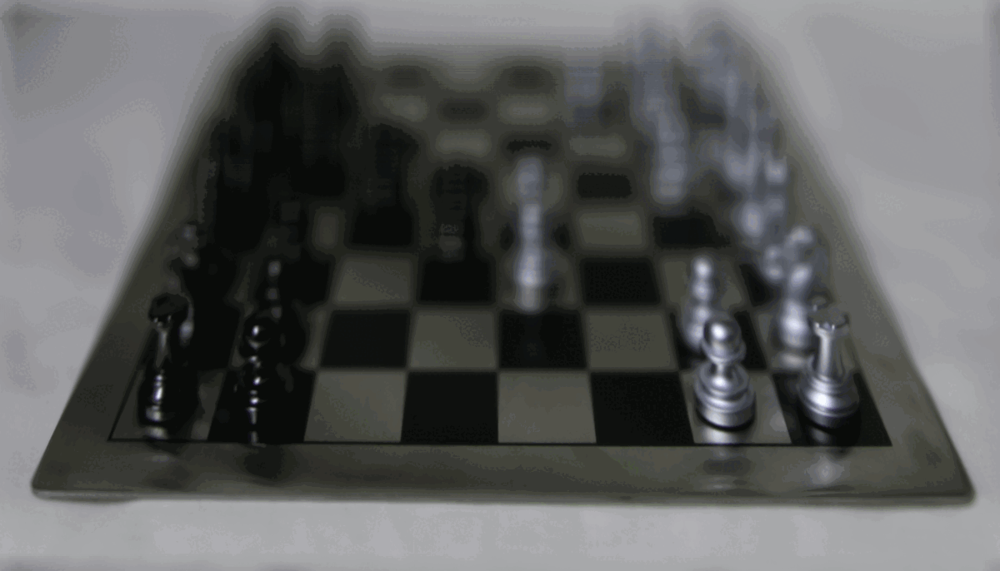
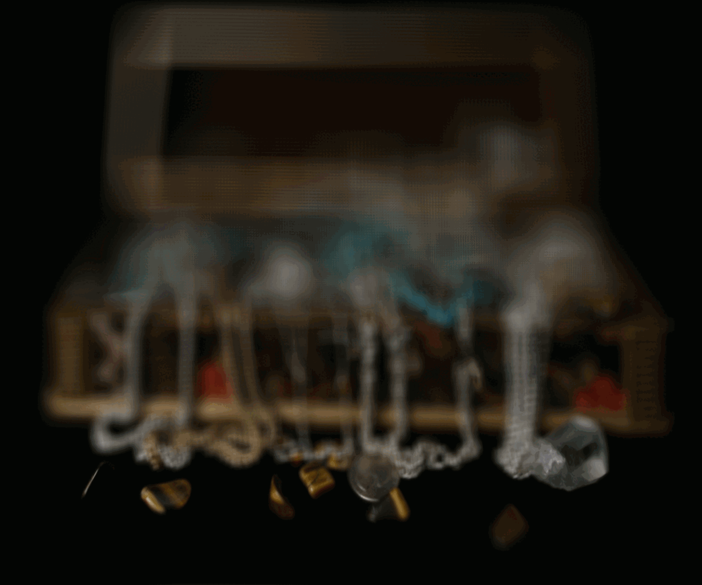
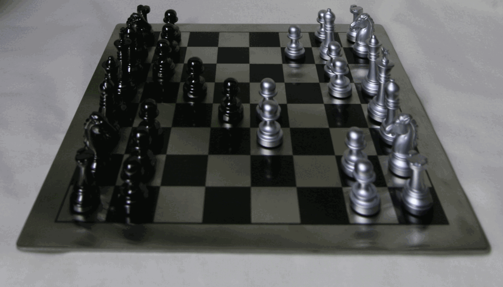
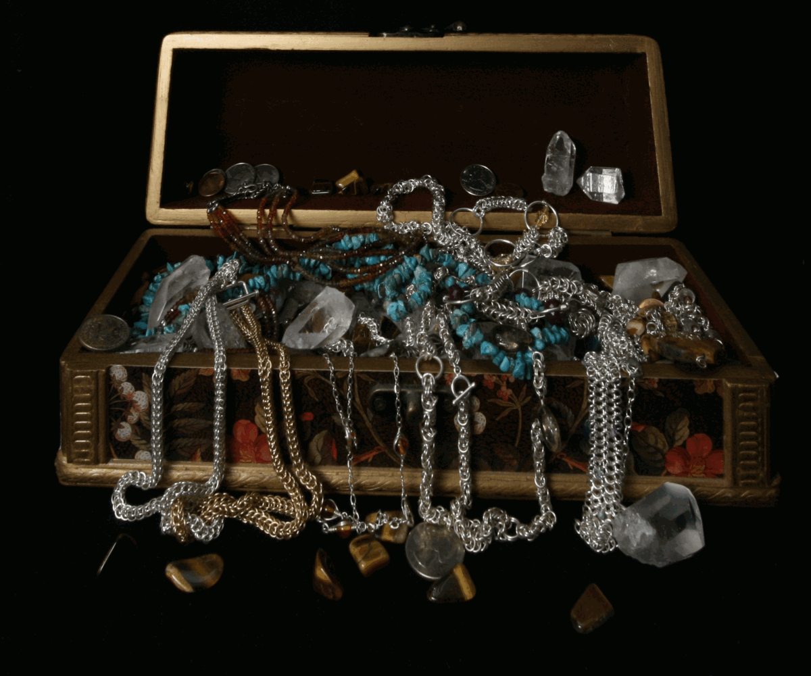
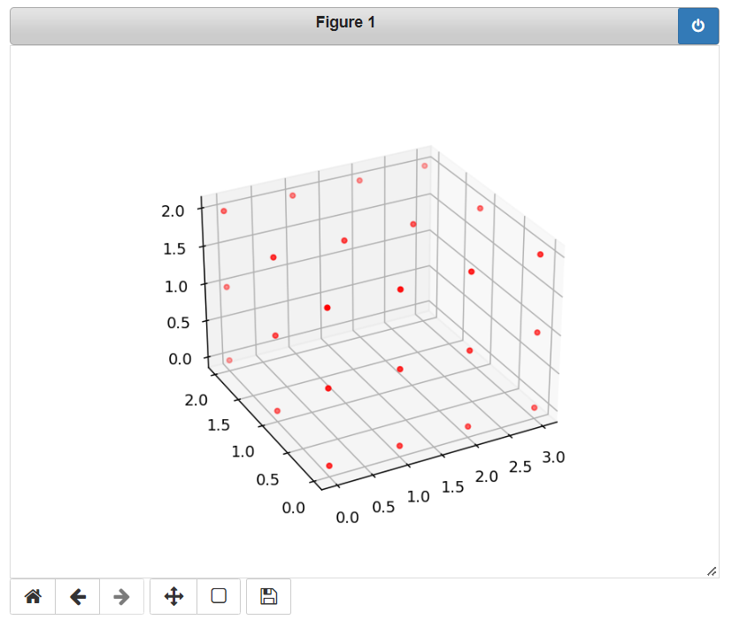
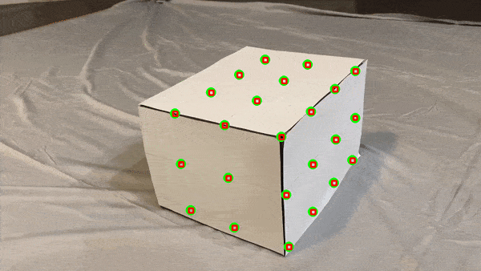
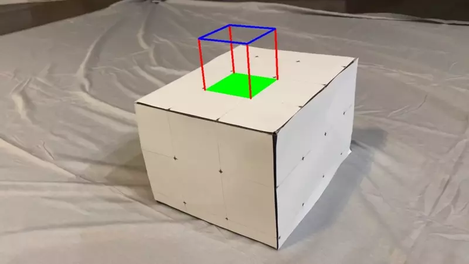

# CS 194-26 Final Project

# Project 1: **Lightfield Camera**

By Archit Das

## Overview

In this project, I simulated different depths of fields and apertures by using lightfield data.

## Step 1: Depth Refocusing

When we change our visual perspective, the distance objects close to us travel is more than objects far away, which is called parallax. Therefore, in order to implement depth refocusing, I could not just average all the images together, as that would just make the background sharp and the foreground very blurry.

To get around this, I picked an image from the lytro grid and chose it as my center image. Then, I shifted the images surrounding the center image by how we want to change the depth focus.

Here I changed the depth of focus for the chess lightfield dataset.

Here I changed the depth of focus for the treasure chest lightfield dataset.

## Step 2: **Aperture Adjustment**

Here, I averaged the surrounding images in the lytro grid perpendicular to the optical axis to create the effect of changing the aperture size. When the aperture size is large, it lets in more light, which means a larger range of the image contributes to the average image, making more of the surrounding image look blurry. As the aperture size decreases, less of the light rays get into the lens, meaning that less of the surrounding images get averaged, making a holistically sharper image.

Here I start with small aperture size and increase it for the chess lightfield dataset.

Here I start with a small aperture size and increase it for the treasure chest lightfield dataset.

## Summary/What I learned

Before this project, I had never heard of a lytro camera. I find the idea of taking multiple shots in a single capture and being able to refocus and image or change aperture sizes to be fascinating. I also learned the intuition to when and why you should change aperture sizes when using traditional optical camera.

# Project 2: Image Quilting

By Archit Das

## Overview

In this project, I captured real-life footage and placed a synthetic object into the scene using homography. 

## Point Selection

I used a regular pattern to automate labeling points. Here is the 3D graph of the points I selected. (4 x 3 x 3 rectangular prism)

## Tracking

I used an off-the-shelf tracker in the cv2 library for tracking my points. I selected 24 points, and I used a 12x12 bounding box size as I found that it best tracked the points without losing a feature or jumping to a neighboring feature. Initially, I had used MedianFlow, but I found that had caused issues with bounding boxes, so I settled on CSRT, which had much better results.

Here are the tracked points with their bounding boxes.

## Camera Calibration

Initially, I used this formula to compute my homography matrix.

However, using least squares for $Ax = 0$ would return the 0 vector for $x$. Therefore, I fixed $m_{34}$ as 1. 

Here is the modified equation for Ax = b

I used least squares to solve for my $m$ values and used that (along with $m_{34}$ as 1) as my H matrix for projecting the cube.

## Cube Projection

I used the homography matrix calculated in camera calibration to project the points of my cube into my scene:

## Summary/What I learned

I had prior experience to Augmented Reality in Unity, but that was all using prepackaged libraries. Here I was able to use homography to place a virtual 3d object into real life scene, and I found that pretty neat.