Proj 4 - part 1  body { padding: 100px; width: 1000px; margin: auto; text-align: left; font-weight: 300; font-family: 'Open Sans', sans-serif; color: #121212; } h1, h2, h3, h4 { font-family: 'Source Sans Pro', sans-serif; } img { display: block; max-width:1000px; max-height:1000px; width: auto; height: auto; } pre code { background-color: #eee; border: 1px solid #999; display: block; padding: 5px; }

Project 5 - Archit Das
======================

Overview: In this project, I trained neural networks to detect facial features. Please find the models and the relevant hyperparameters in the gray boxes below.

Part 1: Nose Tip Detection
--------------------------

For the first part, I trained a CNN to detect noses keypoints. I used MSE loss for my loss function, and Adam for optimization.

DataLoader Nose Ground Truths

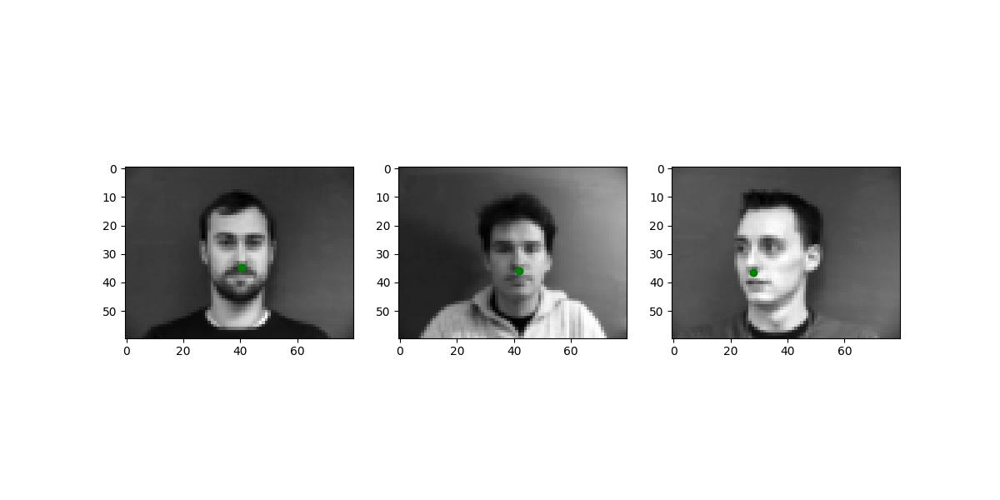

                        `NoseNet(                                         (conv1): Conv2d(1, 12, kernel_size=(5, 5), stride=(1, 1))                                         (conv2): Conv2d(12, 12, kernel_size=(5, 5), stride=(1, 1))                                         (conv3): Conv2d(12, 12, kernel_size=(5, 5), stride=(1, 1))                                         (fc1): Linear(in_features=288, out_features=100, bias=True)                                         (fc2): Linear(in_features=100, out_features=2, bias=True)                                     )                                      Hyperparameters                                     Epochs: 25                                     optimizer: optim.AdamW(self.model.parameters(), lr=1e-4)                                     Loss: MSELoss                                     Batch: 1`
                        
                    

Training and Validation Loss learning rate: 1e-5

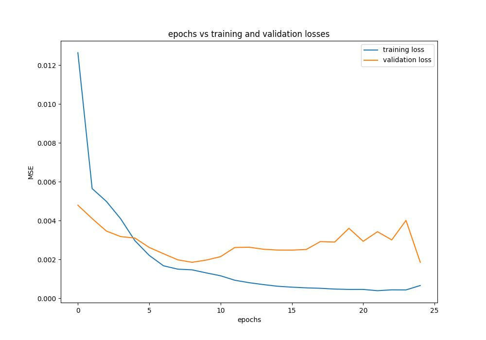

Training and Validation Loss learning rate: 1e-4

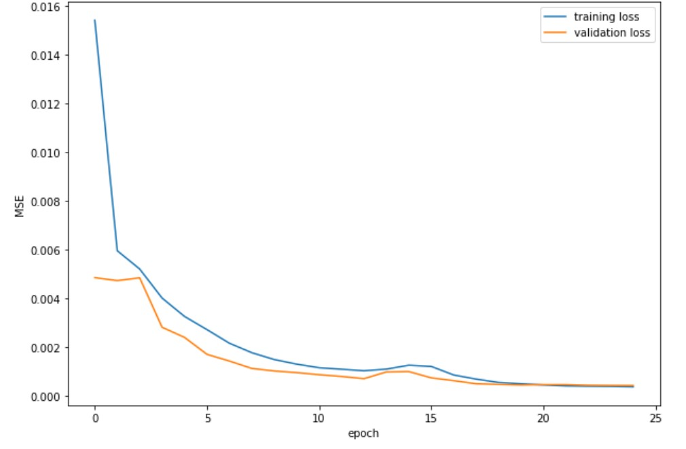

Here I first tried a learning rate of 1e-5, and then tried 1e-4. I picked 1e-4 as my final learning rate.

Best Nose Detections

Worst Nose Detections

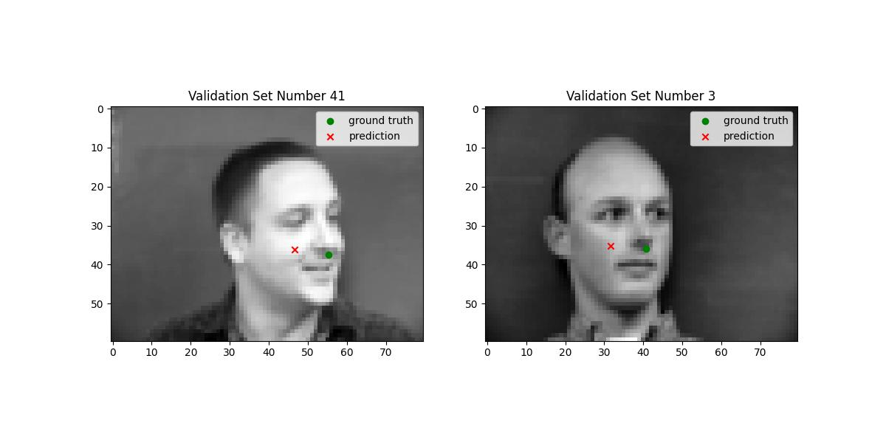

The best images classified well, but the worst images were pretty off. My best guess is since the head is turned, that it predicted incorrectly.

Visualizing filters for layers 1, 2, 3

 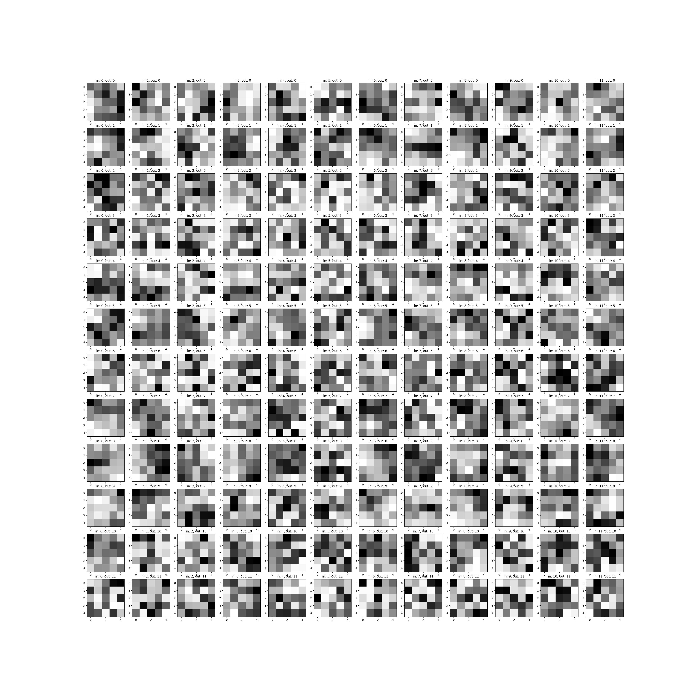 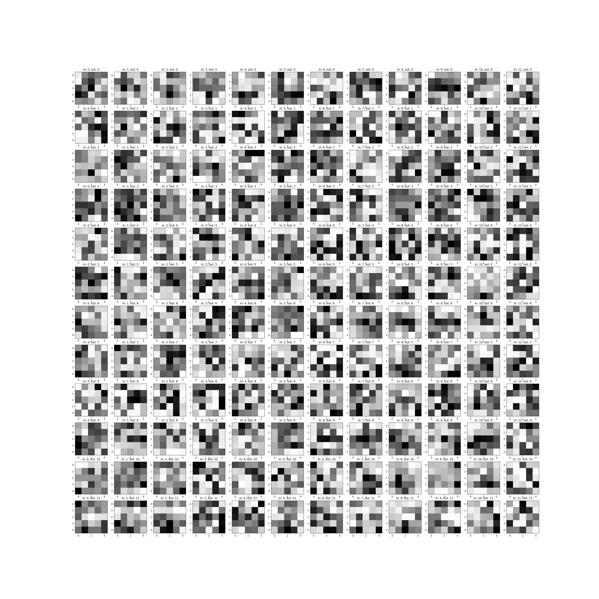

Part 2: Full Facial Keypoints Detection
---------------------------------------

DataLoader Facial Keypoints Ground Truths

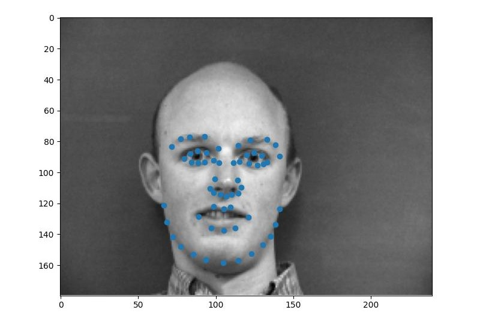

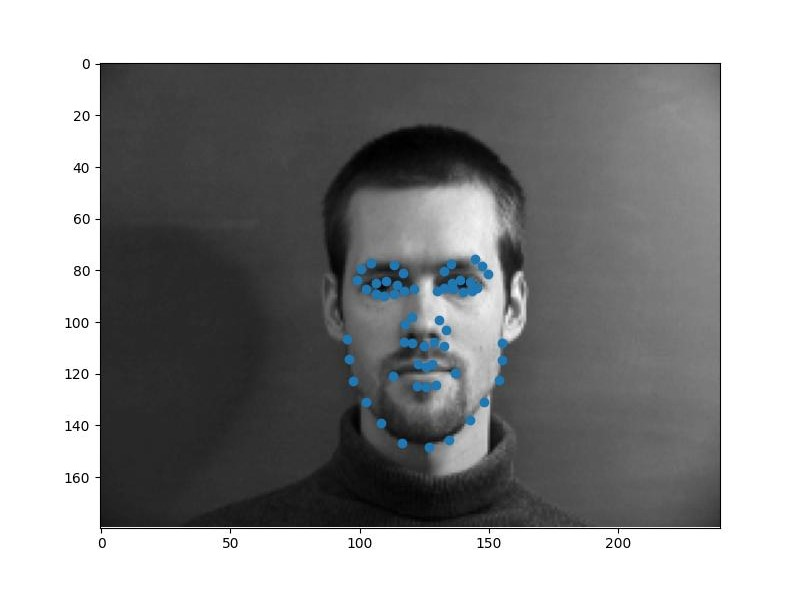

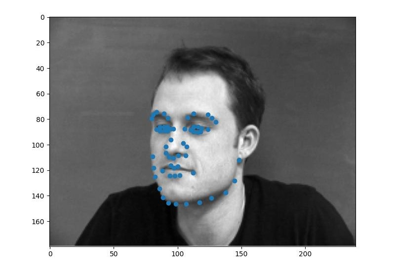

                    `FaceNet(                             (conv1): Conv2d(1, 12, kernel_size=(8, 8), stride=(1, 1))                             (conv2): Conv2d(12, 12, kernel_size=(8, 8), stride=(1, 1))                             (conv3): Conv2d(12, 12, kernel_size=(8, 8), stride=(1, 1))                             (conv4): Conv2d(12, 12, kernel_size=(8, 8), stride=(1, 1))                             (conv5): Conv2d(12, 12, kernel_size=(8, 8), stride=(1, 1))                             (fc1): Linear(in_features=3276, out_features=500, bias=True)                             (fc2): Linear(in_features=500, out_features=116, bias=True)                         )                          Hyperparameters                         Epochs: 25                         optimizer: optim.AdamW(self.model.parameters(), lr=1e-3)                         Loss: MSELoss                         Batch: 1`
                    
                

Training and Validation Loss

Best Nose Detections

Worst Nose Detections

The best images classified relatively well, but the worst images were pretty off. Again, my best guess is since the head is turned so much, that it predicted incorrectly. This would probably be remedied by a larger dataset.

Visualizing filters for layers 1, 2, 3

 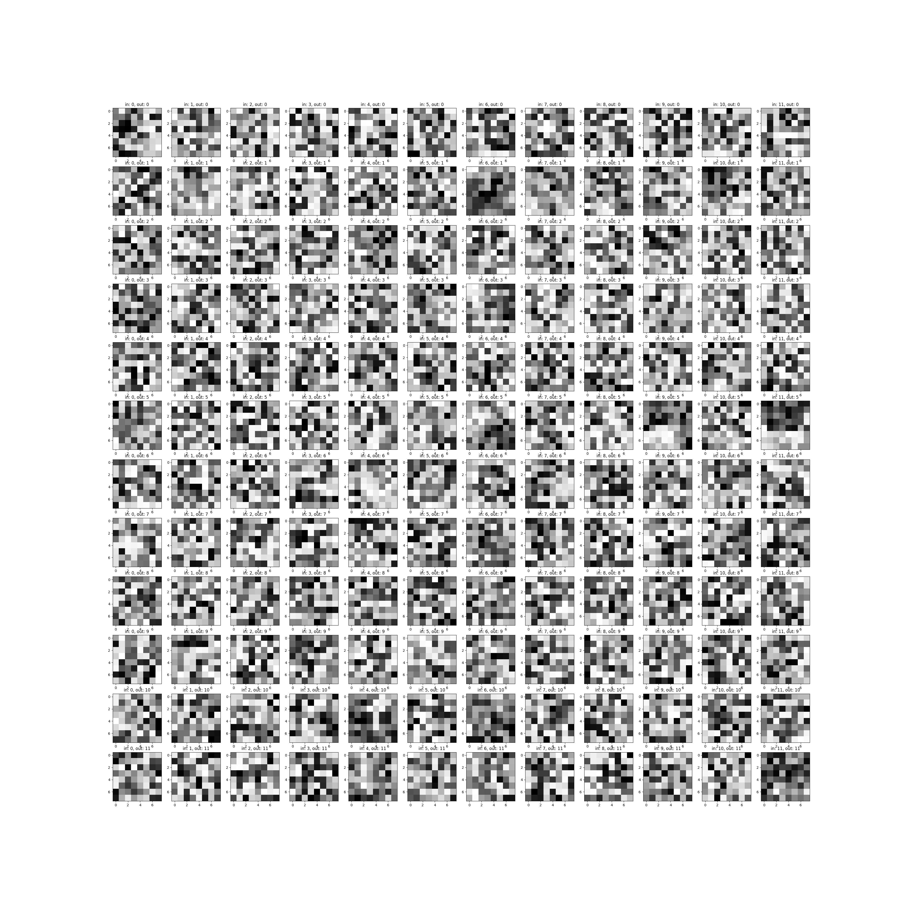 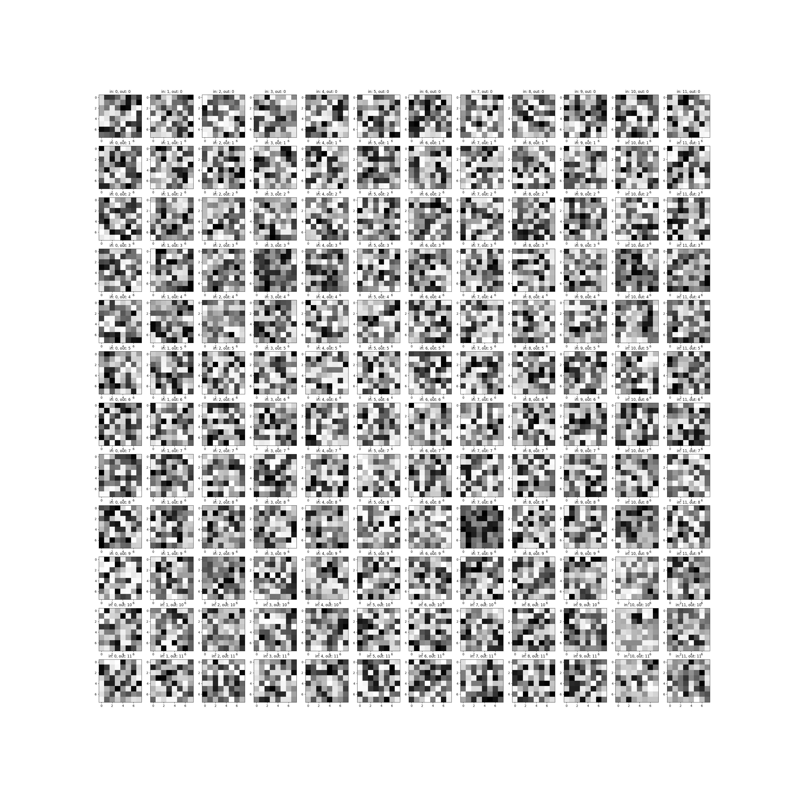

Part 3: Train With Larger Dataset
---------------------------------

                `ResNet(                         (conv1): Conv2d(1, 64, kernel_size=(7, 7), stride=(2, 2), padding=(2, 2), bias=False)                         (bn1): BatchNorm2d(64, eps=1e-05, momentum=0.1, affine=True, track_running_stats=True)                         (relu): ReLU(inplace=True)                         (maxpool): MaxPool2d(kernel_size=3, stride=2, padding=1, dilation=1, ceil_mode=False)                         (layer1): Sequential(                           (0): BasicBlock(                             (conv1): Conv2d(64, 64, kernel_size=(3, 3), stride=(1, 1), padding=(1, 1), bias=False)                             (bn1): BatchNorm2d(64, eps=1e-05, momentum=0.1, affine=True, track_running_stats=True)                             (relu): ReLU(inplace=True)                             (conv2): Conv2d(64, 64, kernel_size=(3, 3), stride=(1, 1), padding=(1, 1), bias=False)                             (bn2): BatchNorm2d(64, eps=1e-05, momentum=0.1, affine=True, track_running_stats=True)                           )                           (1): BasicBlock(                             (conv1): Conv2d(64, 64, kernel_size=(3, 3), stride=(1, 1), padding=(1, 1), bias=False)                             (bn1): BatchNorm2d(64, eps=1e-05, momentum=0.1, affine=True, track_running_stats=True)                             (relu): ReLU(inplace=True)                             (conv2): Conv2d(64, 64, kernel_size=(3, 3), stride=(1, 1), padding=(1, 1), bias=False)                             (bn2): BatchNorm2d(64, eps=1e-05, momentum=0.1, affine=True, track_running_stats=True)                           )                         )                         (layer2): Sequential(                           (0): BasicBlock(                             (conv1): Conv2d(64, 128, kernel_size=(3, 3), stride=(2, 2), padding=(1, 1), bias=False)                             (bn1): BatchNorm2d(128, eps=1e-05, momentum=0.1, affine=True, track_running_stats=True)                             (relu): ReLU(inplace=True)                             (conv2): Conv2d(128, 128, kernel_size=(3, 3), stride=(1, 1), padding=(1, 1), bias=False)                             (bn2): BatchNorm2d(128, eps=1e-05, momentum=0.1, affine=True, track_running_stats=True)                             (downsample): Sequential(                               (0): Conv2d(64, 128, kernel_size=(1, 1), stride=(2, 2), bias=False)                               (1): BatchNorm2d(128, eps=1e-05, momentum=0.1, affine=True, track_running_stats=True)                             )                           )                           (1): BasicBlock(                             (conv1): Conv2d(128, 128, kernel_size=(3, 3), stride=(1, 1), padding=(1, 1), bias=False)                             (bn1): BatchNorm2d(128, eps=1e-05, momentum=0.1, affine=True, track_running_stats=True)                             (relu): ReLU(inplace=True)                             (conv2): Conv2d(128, 128, kernel_size=(3, 3), stride=(1, 1), padding=(1, 1), bias=False)                             (bn2): BatchNorm2d(128, eps=1e-05, momentum=0.1, affine=True, track_running_stats=True)                           )                         )                         (layer3): Sequential(                           (0): BasicBlock(                             (conv1): Conv2d(128, 256, kernel_size=(3, 3), stride=(2, 2), padding=(1, 1), bias=False)                             (bn1): BatchNorm2d(256, eps=1e-05, momentum=0.1, affine=True, track_running_stats=True)                             (relu): ReLU(inplace=True)                             (conv2): Conv2d(256, 256, kernel_size=(3, 3), stride=(1, 1), padding=(1, 1), bias=False)                             (bn2): BatchNorm2d(256, eps=1e-05, momentum=0.1, affine=True, track_running_stats=True)                             (downsample): Sequential(                               (0): Conv2d(128, 256, kernel_size=(1, 1), stride=(2, 2), bias=False)                               (1): BatchNorm2d(256, eps=1e-05, momentum=0.1, affine=True, track_running_stats=True)                             )                           )                           (1): BasicBlock(                             (conv1): Conv2d(256, 256, kernel_size=(3, 3), stride=(1, 1), padding=(1, 1), bias=False)                             (bn1): BatchNorm2d(256, eps=1e-05, momentum=0.1, affine=True, track_running_stats=True)                             (relu): ReLU(inplace=True)                             (conv2): Conv2d(256, 256, kernel_size=(3, 3), stride=(1, 1), padding=(1, 1), bias=False)                             (bn2): BatchNorm2d(256, eps=1e-05, momentum=0.1, affine=True, track_running_stats=True)                           )                         )                         (layer4): Sequential(                           (0): BasicBlock(                             (conv1): Conv2d(256, 512, kernel_size=(3, 3), stride=(2, 2), padding=(1, 1), bias=False)                             (bn1): BatchNorm2d(512, eps=1e-05, momentum=0.1, affine=True, track_running_stats=True)                             (relu): ReLU(inplace=True)                             (conv2): Conv2d(512, 512, kernel_size=(3, 3), stride=(1, 1), padding=(1, 1), bias=False)                             (bn2): BatchNorm2d(512, eps=1e-05, momentum=0.1, affine=True, track_running_stats=True)                             (downsample): Sequential(                               (0): Conv2d(256, 512, kernel_size=(1, 1), stride=(2, 2), bias=False)                               (1): BatchNorm2d(512, eps=1e-05, momentum=0.1, affine=True, track_running_stats=True)                             )                           )                           (1): BasicBlock(                             (conv1): Conv2d(512, 512, kernel_size=(3, 3), stride=(1, 1), padding=(1, 1), bias=False)                             (bn1): BatchNorm2d(512, eps=1e-05, momentum=0.1, affine=True, track_running_stats=True)                             (relu): ReLU(inplace=True)                             (conv2): Conv2d(512, 512, kernel_size=(3, 3), stride=(1, 1), padding=(1, 1), bias=False)                             (bn2): BatchNorm2d(512, eps=1e-05, momentum=0.1, affine=True, track_running_stats=True)                           )                         )                         (avgpool): AdaptiveAvgPool2d(output_size=(1, 1))                         (fc): Linear(in_features=512, out_features=136, bias=True)                     )                                          Hyperparameters                     Epochs: 16                     optimizer: optim.AdamW(self.model.parameters(), lr=1e-3)                     Loss: MSELoss                     Batch: 128`
                
            

Training and Validation Loss

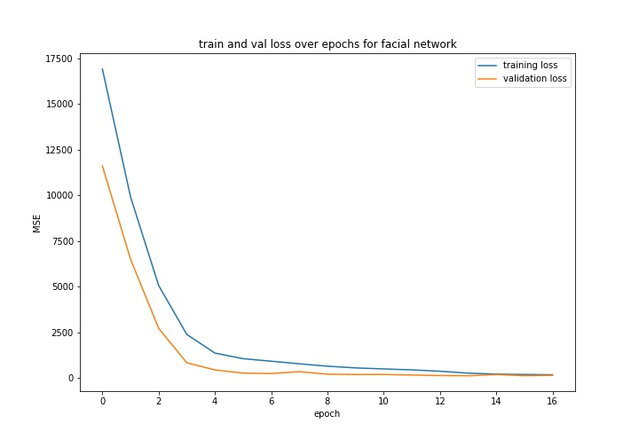

Test Predictions from my model

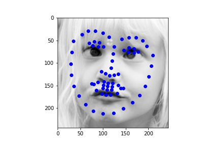

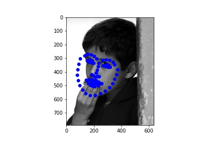

Predictions of my own images from my model

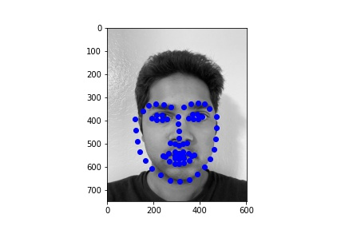

Part 4: Train With Larger Dataset
---------------------------------

                    `UNet(                         (encoder1): Sequential(                           (enc1conv1): Conv2d(3, 32, kernel_size=(3, 3), stride=(1, 1), padding=(1, 1), bias=False)                           (enc1norm1): BatchNorm2d(32, eps=1e-05, momentum=0.1, affine=True, track_running_stats=True)                           (enc1relu1): ReLU(inplace=True)                           (enc1conv2): Conv2d(32, 32, kernel_size=(3, 3), stride=(1, 1), padding=(1, 1), bias=False)                           (enc1norm2): BatchNorm2d(32, eps=1e-05, momentum=0.1, affine=True, track_running_stats=True)                           (enc1relu2): ReLU(inplace=True)                         )                         (pool1): MaxPool2d(kernel_size=2, stride=2, padding=0, dilation=1, ceil_mode=False)                         (encoder2): Sequential(                           (enc2conv1): Conv2d(32, 64, kernel_size=(3, 3), stride=(1, 1), padding=(1, 1), bias=False)                           (enc2norm1): BatchNorm2d(64, eps=1e-05, momentum=0.1, affine=True, track_running_stats=True)                           (enc2relu1): ReLU(inplace=True)                           (enc2conv2): Conv2d(64, 64, kernel_size=(3, 3), stride=(1, 1), padding=(1, 1), bias=False)                           (enc2norm2): BatchNorm2d(64, eps=1e-05, momentum=0.1, affine=True, track_running_stats=True)                           (enc2relu2): ReLU(inplace=True)                         )                         (pool2): MaxPool2d(kernel_size=2, stride=2, padding=0, dilation=1, ceil_mode=False)                         (encoder3): Sequential(                           (enc3conv1): Conv2d(64, 128, kernel_size=(3, 3), stride=(1, 1), padding=(1, 1), bias=False)                           (enc3norm1): BatchNorm2d(128, eps=1e-05, momentum=0.1, affine=True, track_running_stats=True)                           (enc3relu1): ReLU(inplace=True)                           (enc3conv2): Conv2d(128, 128, kernel_size=(3, 3), stride=(1, 1), padding=(1, 1), bias=False)                           (enc3norm2): BatchNorm2d(128, eps=1e-05, momentum=0.1, affine=True, track_running_stats=True)                           (enc3relu2): ReLU(inplace=True)                         )                         (pool3): MaxPool2d(kernel_size=2, stride=2, padding=0, dilation=1, ceil_mode=False)                         (encoder4): Sequential(                           (enc4conv1): Conv2d(128, 256, kernel_size=(3, 3), stride=(1, 1), padding=(1, 1), bias=False)                           (enc4norm1): BatchNorm2d(256, eps=1e-05, momentum=0.1, affine=True, track_running_stats=True)                           (enc4relu1): ReLU(inplace=True)                           (enc4conv2): Conv2d(256, 256, kernel_size=(3, 3), stride=(1, 1), padding=(1, 1), bias=False)                           (enc4norm2): BatchNorm2d(256, eps=1e-05, momentum=0.1, affine=True, track_running_stats=True)                           (enc4relu2): ReLU(inplace=True)                         )                         (pool4): MaxPool2d(kernel_size=2, stride=2, padding=0, dilation=1, ceil_mode=False)                         (bottleneck): Sequential(                           (bottleneckconv1): Conv2d(256, 512, kernel_size=(3, 3), stride=(1, 1), padding=(1, 1), bias=False)                           (bottlenecknorm1): BatchNorm2d(512, eps=1e-05, momentum=0.1, affine=True, track_running_stats=True)                           (bottleneckrelu1): ReLU(inplace=True)                           (bottleneckconv2): Conv2d(512, 512, kernel_size=(3, 3), stride=(1, 1), padding=(1, 1), bias=False)                           (bottlenecknorm2): BatchNorm2d(512, eps=1e-05, momentum=0.1, affine=True, track_running_stats=True)                           (bottleneckrelu2): ReLU(inplace=True)                         )                         (upconv4): ConvTranspose2d(512, 256, kernel_size=(2, 2), stride=(2, 2))                         (decoder4): Sequential(                           (dec4conv1): Conv2d(512, 256, kernel_size=(3, 3), stride=(1, 1), padding=(1, 1), bias=False)                           (dec4norm1): BatchNorm2d(256, eps=1e-05, momentum=0.1, affine=True, track_running_stats=True)                           (dec4relu1): ReLU(inplace=True)                           (dec4conv2): Conv2d(256, 256, kernel_size=(3, 3), stride=(1, 1), padding=(1, 1), bias=False)                           (dec4norm2): BatchNorm2d(256, eps=1e-05, momentum=0.1, affine=True, track_running_stats=True)                           (dec4relu2): ReLU(inplace=True)                         )                         (upconv3): ConvTranspose2d(256, 128, kernel_size=(2, 2), stride=(2, 2))                         (decoder3): Sequential(                           (dec3conv1): Conv2d(256, 128, kernel_size=(3, 3), stride=(1, 1), padding=(1, 1), bias=False)                           (dec3norm1): BatchNorm2d(128, eps=1e-05, momentum=0.1, affine=True, track_running_stats=True)                           (dec3relu1): ReLU(inplace=True)                           (dec3conv2): Conv2d(128, 128, kernel_size=(3, 3), stride=(1, 1), padding=(1, 1), bias=False)                           (dec3norm2): BatchNorm2d(128, eps=1e-05, momentum=0.1, affine=True, track_running_stats=True)                           (dec3relu2): ReLU(inplace=True)                         )                         (upconv2): ConvTranspose2d(128, 64, kernel_size=(2, 2), stride=(2, 2))                         (decoder2): Sequential(                           (dec2conv1): Conv2d(128, 64, kernel_size=(3, 3), stride=(1, 1), padding=(1, 1), bias=False)                           (dec2norm1): BatchNorm2d(64, eps=1e-05, momentum=0.1, affine=True, track_running_stats=True)                           (dec2relu1): ReLU(inplace=True)                           (dec2conv2): Conv2d(64, 64, kernel_size=(3, 3), stride=(1, 1), padding=(1, 1), bias=False)                           (dec2norm2): BatchNorm2d(64, eps=1e-05, momentum=0.1, affine=True, track_running_stats=True)                           (dec2relu2): ReLU(inplace=True)                         )                         (upconv1): ConvTranspose2d(64, 32, kernel_size=(2, 2), stride=(2, 2))                         (decoder1): Sequential(                           (dec1conv1): Conv2d(64, 32, kernel_size=(3, 3), stride=(1, 1), padding=(1, 1), bias=False)                           (dec1norm1): BatchNorm2d(32, eps=1e-05, momentum=0.1, affine=True, track_running_stats=True)                           (dec1relu1): ReLU(inplace=True)                           (dec1conv2): Conv2d(32, 32, kernel_size=(3, 3), stride=(1, 1), padding=(1, 1), bias=False)                           (dec1norm2): BatchNorm2d(32, eps=1e-05, momentum=0.1, affine=True, track_running_stats=True)                           (dec1relu2): ReLU(inplace=True)                         )                         (conv): Conv2d(32, 68, kernel_size=(7, 7), stride=(1, 1), padding=(3, 3), bias=False)                       )                            Hyperparameters                           Hyperparameters                           Epochs: 20                           optimizer: optim.AdamW(self.model.parameters(), lr=1e-3)                           Loss: MSELoss                           Batch: 16`

                    
                

Augmented Image with heatmap

In order to generate heatmaps, I placed an augmented label onto a 224 x 224 blank canvas and then I convolved it with gaussian filter with a kernel width of 15 and a sigma of 5. For my model, I had 68 heatmaps for an image, one for each label, but here I superimposed them all for visualization.

Training and Validation Loss

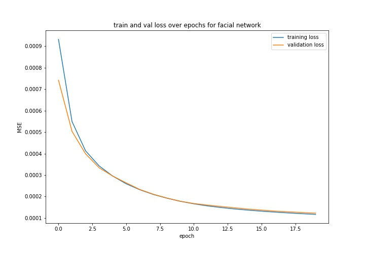

Test Set Predictions and Heatmaps

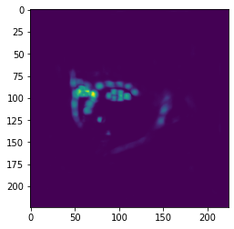

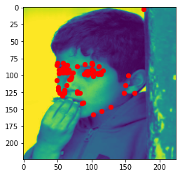

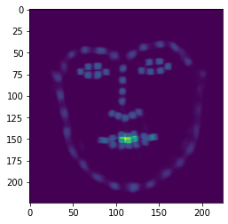

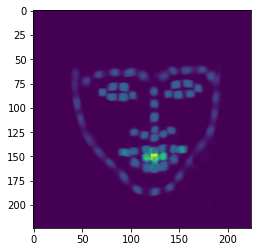

Personal Image heatmaps and predictions

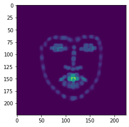

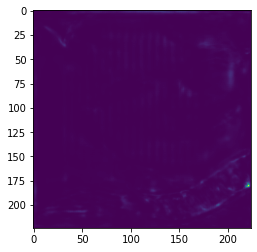

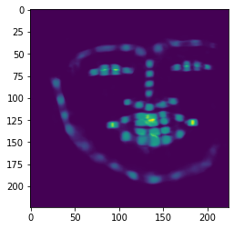

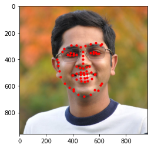

The heatmap model worked pretty well for my face, but not too well for my friend, probably due to the existing photo edits.

Part 5: Kaggle
--------------

My best model was using resnet18, and I achieved a MAE of 20.76934. My Kaggle username is Archit Das.